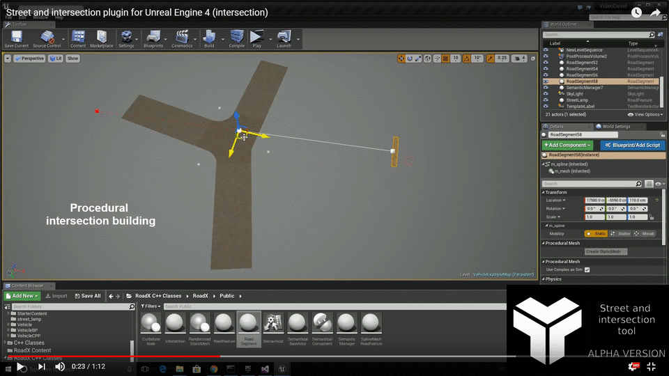

# StreetArch
Procedural street and intersection building tool and plugin for Unreal Engine 4

For full demo videos and discussion visit the [Unreal Forum discussion page](https://forums.unrealengine.com/community/community-content-tools-and-tutorials/1433781-tool-procedural-street-and-intersection-building-tool).

## Install

Just download the release of this repository and copy it to the Plugins subfolder of your project. Make sure that you downloaded the version corresponding to your Unreal Engine 4 version.

## Usage

### Actors that can be placed in Editor (instanced actors):

**Road Segment** - A simple road segment and a primary building block of streets and intersections. The road shape can be modified by manipulating the spline and it supports many editable properties. *Snapping* road segments on their endpoints will automatically create an intersection.

**Road Feature** - A roadside element which position is defined with respect to the road segment spline. After instancing a Road Feature drag it under any Road Segment actor in the World Outliner (i.e. make it a sub-actor of the Road Segment). Then the Road Feature will strictly follow the shape of the road segment and adapt to it. One may add components to a road feature, such as Static Mesh or StreetArch provided *Randomized Static Mesh*. Use different properties of the road feature to make it even more flexible (for example use *Fix actor orientation* to have constant angle between the Road Feature and Road Segment (for example in order to have buildings that always face the road...).

**Spline Mesh Road Feature** - An actor derived from the road feature which has a Mesh that is deformed baesd on the road segment spline. Great for creating lanes, sidewalks and etc.

## Development

This is currently an alpha version binary-only release of the Unreal Engine 4 plugin supporting only Win64 platform. Each engine version is supported in its own branch that is released on the release page. It is primarily intended for testing and evaluation purposes and is provided under the terms of the [EULA](License.md). 
